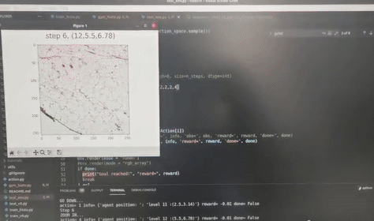

<p align="center">
  
</p>


# *HistoGym*: A  Reinforcement Learning Environment for Histopathological Image Analysis

> [Zhi-Bo Liu](http://zhibo-liu.com)

- [1.Environment Setup](#1-Environment-Setup)
- [2.Tutorial](#2-Tutorial)
- [3.Reference](#3-Reference)
- [4.Trouble Shootings](#4-Trouble-Shootings)
- [5.Doc](#5-Doc)

**TODO**

- [ ] Tutorials
- [ ] Demos

# 1. Environment Setup      

## 1.0 Ready to go

```bash
conda activate historl-sb3
python gymhisto.py # testing if python env setup susscessfully
```

## 1.1 Install `openslide` & Dependencies

> **Openslide Requirements**
>
> - Python >= 3.6
> - OpenSlide >= 3.4.0
> - Pillow

Install `openslide`

```bash
sudo apt install openslide-tools 
```

## 1.2 Conda Create `historl-sb3`

 `environment.yml` file

```yaml
name: hisotrl-sb3
channels:
  - defaults
  - pytorch
dependencies:
  - python=3.8.12
  - pytorch::pytorch=1.10.2
  - pytorch::torchvision=0.11.3
  - cudatoolkit=11.3.1
  - numpy=1.21.2
  - ipykernel=6.19.2
  - jupyter=1.0.0
  - shapely=1.7.1
  - matplotlib
  - pip
  - pip:
    - gym
    - tensorboard
    - openslide-python
    - opencv-python

```

Create Conda Env using `environment.yml`

```bash
conda env create -f environment.yml
```

## 1.3 Install `stable-baselines3` / `tianshou`

```bash
pip install stable-baselines3[extra]
```


# 2. Tutorial

TODO: This Jupyter Notebook tutorial will guide you through the foundational concepts of HistoGym and provide step-by-step instructions on how to effectively utilize its features.


# 3. Reference

## RL Framwork

- [Stable Baselines 3](https://github.com/DLR-RM/stable-baselines3) 
-  [Tianshou](https://github.com/thu-ml/tianshou) 


## Datasets

- [Camelyon16](https://camelyon16.grand-challenge.org/)  Breast 
- [Camelyon17](https://camelyon17.grand-challenge.org/)  Breast 
- [BreakHis](https://web.inf.ufpr.br/vri/databases/breast-cancer-histopathological-database-breakhis/)       Breast 
- [BCSC](https://bcsegmentation.grand-challenge.org/)              Breast Tissue Region 
- [ACDC-HP](https://acdc-lunghp.grand-challenge.org/)        Lung Segmentaion WSI 

# 4. Trouble Shootings

## `Openslide render error,lack some tiles : update pixman version`

Install `pixman=0.4`

> updating [pixman to version 0.4](https://github.com/freedesktop/pixman/releases), which can be done by following these [instructions](https://www.linuxfromscratch.org/blfs/view/cvs/general/pixman.html).

- Download (HTTP): https://www.cairographics.org/releases/pixman-0.40.0.tar.gz
- or [release](https://github.com/freedesktop/pixman/releases)

Install Pixman by running the following commands:

```bash
mkdir build &&
cd    build &&

meson --prefix=/usr &&
ninja
```

To test the results, issue: **ninja test**.

Now, as the `root` user:

```bash
ninja install
```


# 5. Doc

## `class HistoEnv(gym.Env):`


Custom environment for histology image analysis.

**Parameters:**

- `img_path (str): Path to the histology image file.
- `xml_path (str): Path to the XML file containing annotations.
- `tile_size (int): Size of the tiles used for analysis.
- `result_path (str): Path to save the resulting images.

**Attributes**:

- `UP (int)`: Action code for moving up.
- `DOWN (int)`: Action code for moving down.
- `LEFT (int):` Action code for moving left.
- `RIGHT (int)`: Action code for moving right.
- `ZOOM_IN (int)`: Action code for zooming in.
- `ZOOM_OUT (int)`: Action code for zooming out.
- `STAY (int)`: Action code for staying in the same position.
- `img_path (str)`: Path to the histology image file.
- `xml_path (str)`: Path to the XML file containing annotations.
- `tile_size (int)`: Size of the tiles used for analysis.
- `result_path (str)`: Path to save the resulting images.
- `plt_size (int)`: Size of the plot.
- `slide (openslide.OpenSlide)`: OpenSlide object for reading the histology image.
- `dz (DeepZoomGenerator)`: DeepZoomGenerator object for generating tiles.
- `dz_level (int)`: Initial DeepZoom level.
- `OBS_W (int)`: Observation width.
- `OBS_H (int)`: Observation height.
- `STATE_W (int)`: State width.
- `STATE_H (int)`: State height.
- `coor_xml (Coor)`: Coor object for parsing XML annotations.
- `coor_dz_all (Coor)`: Coor object for getting DeepZoom coordinates.
- `segment_dz_all (Coor)`: Coor object for getting segment coordinates.
- `if_overlap (bool)`: Flag indicating if there is overlap.
- `overlap_seg_index (int)`: Index of the overlapping segment.
- `overlap_ratio (float)`: Ratio of overlap.
- `n_actions (int)`: Number of actions.
- `action_space (gym.spaces.Discrete)`: Action space.
- `observation_space (gym.spaces.Box)`: Observation space.
- `agent_pos (list)`: Agent position in the form [z, x, y].
- `STATE_D (int)`: Initial DeepZoom level for setting bounds.
- `state (numpy.ndarray)`: Current state.
- `count (int)`: Step count within the episode.
- `max_step (int)`: Maximum number of steps per episode.
- `bound (list)`: List of bounds.

**Methods**:

- `__init__`(self, img_path, xml_path, tile_size, result_path)`: Initializes the environment.
- `reset(self)`: Resets the environment and returns the initial state.
- `step(self, action)`: Takes a step in the environment based on the given action.
- `render(self, mode="save")`: Renders the current state of the environment.


